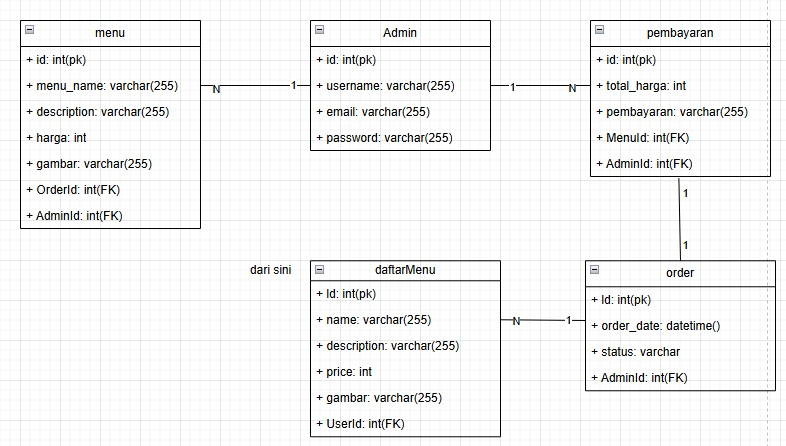
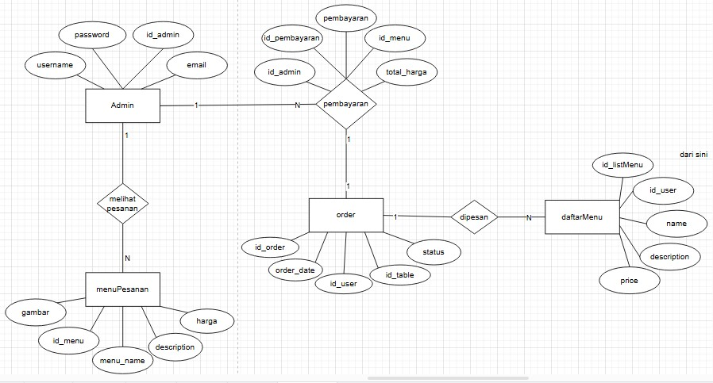

# CASE PROJECT
management restaurant yang berfungsi untuk memanage sebuah customer, order, transaksi, menu dan table(meja)

# DESKRIPSI CASE
dalam project ini memiliki 3 Entitas utama yang berhubungan satu sama lain :
1. Admin : Admin atau kasir dari case management order.

2. Order : Customer yang ingin melakukan order.

3. daftarMenu : List menu yang tersedia.

4. menuPesanan : Menu pesanan yang telah dipesan.

5. Transaksi : Transaksi pembayaran antara customer dan kasir.

# RELASI ANTAR ENTITAS
<<<<<<< HEAD
1. Admin ke Menu : Admin dapat melihat banyak pesanan menu yang telah dipesan. ( Relasi: one-to-many ).

2. Admin ke Pembayaran : Admin dapat melakukan banyak transaksi pembayaran. ( Relasi: one-to-many ).

3. Order ke Pembayaran : Order dapat melakukan hanya dengan satu kali transaksi pembayaran. ( Relasi: one-to-one ).

4. Order ke daftarMenu : Saat Order dapat melihat banyak daftar menu. ( Relasi: one-to-many ).

5. Admin ke daftarMenu : Dan Admin juga dapat melihat banyak daftar menu. ( Relasi: one-to-many ).
=======
1.Pelanggan ke Meja: Setiap pelanggan hanya bisa memilih/memesan satu meja dan sebaliknya.
    Relasi: One-to-One

2.Pelanggan ke Menu : Setiap pelanggan bisa memilih beberapa menu untuk dipesan dan sebaliknya.
    Relasi: One-to-Many

3.Pelanggan ke Pesanan(Order) : Setiap pelanggan dapat memesan banyak Orderan dan sebaliknya.
    Relasi: One-to-Many

4.Pesanan(Order) ke Pelanggan: Banyaknya setiap pesanan terkait dengan satu pelanggan.
    Relasi: Many-to-One
    
5.Pesanan(Order) ke Menu: Dalam satu kali pesanan(order) dapat memesan banyak menu dan sebaliknya.
    Relasi: One-to-Many
    
6.Meja ke Pesanan(order): Satu meja dapat menerima banyaknya pesanan(order) yang dipesan dan sebaliknya.
    Relasi: One-to-Many

7.Pesanan(Order) ke Meja: Banyaknya setiap pesanan hanya terkait dengan satu meja yang dipesan oleh pelanggan.
    Relasi: Many-to-One

8.Customer ke Transaksi: Setiap customer dapat membayar atau melakukan transaksi dengan hanya sekali transaksi.
    Relasi: One-to-One
>>>>>>> d9b1f47e86fea146e9083550fa0b437891db875a
    

PROJECT INI DIBUAT UNTUK TUGAS BACKEND EXPRESS JS MENGGUNAKAN ORM SEQUELIZE DAN SISTEM CRUD

# UML
UML (Unified Modeling Language) adalah bahasa visual yang digunakan untuk membuat diagram dan model yang mewakili sistem software. UML membantu software developer, engineer, dan stakeholders lain untuk berkomunikasi dan berkolaborasi selama proses pengembangan software

### CLASS DIAGRAM
Class diagram atau diagram kelas adalah salah satu jenis diagram struktur pada UML yang menggambarkan dengan jelas struktur serta deskripsi class, atribut, metode, dan hubungan dari setiap objek.

### ERD
ERD adalah kepanjangan dari entity relationship diagram. ERD memvisualisasikan hubungan dari seluruh entitas seperti orang, benda, atau konsep dalam sebuah database serta atribut dari entitas tersebut.

# COPYRIGHT BY © cirss_
